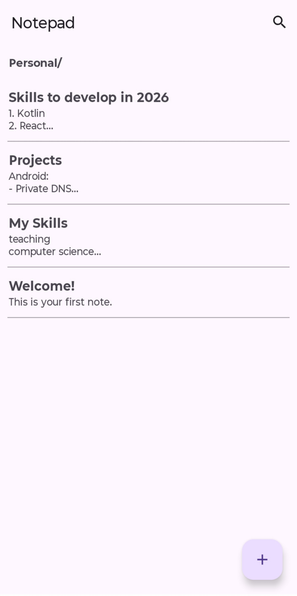
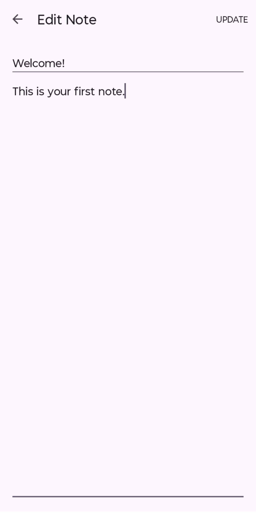
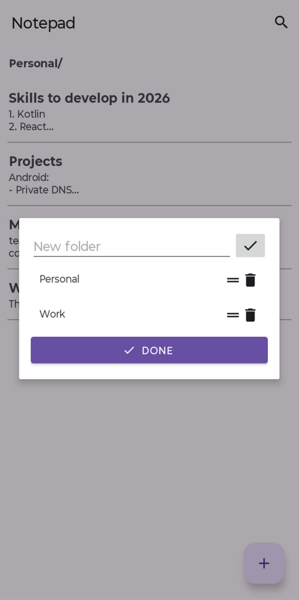
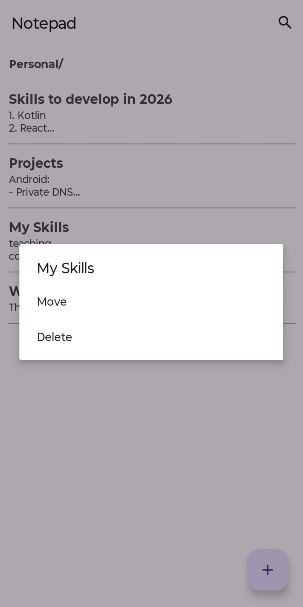

# Notepad

This project brings you the features I've always wanted in a Notepad but wasn't fortunate enough to find anything similar so I built it anyways.

## 📥 Download

## 🖼️ Screenshots

**Spotlight feature** include:
- **"Folderization" of Notes**: Ability to arrange and group notes into "folders".

Apart from this, the app contains all the basics you'd expect. To list a few:
- Complete CRUD operation across notes
- Searching of Notes
- Flat design

## 🛠 Todo
A lot of good stuff is yet to be implemented. Stay tuned. [TODO](https://github.com/arkaputatundaofficial/Notepad/blob/main/todo.md)

## ✍ Feedback
Let me know if you faced any hickups while using it or any suggestions you have for me by raising an issue.
